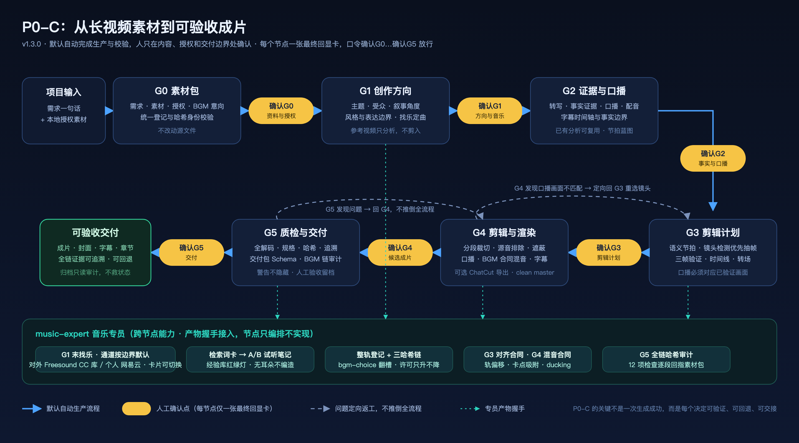

# P0-C · 长视频切片与本地自动成片 Skill

一套面向长视频二次剪辑的**本地化、可追溯**自动成片流程，以 Agent Skill 的形式组织：用户提供已授权的本地素材和一句剪辑意图，系统经过六个节点、人工审核门禁、确定性本地处理和质检，输出可播放成片与完整交付证据。

它要解决的不是"AI 能不能拼出一支视频"，而是自动剪辑常见的失控点：画面与口播不对应、素材授权不清、方案只存在对话里无法交接、成片无法追溯、出问题只能推倒重来。

> 本项目原名 Video-shipcut，v1.1.0 起按公司平台项目代号统一更名为 **P0-C**，编排入口 Skill 为 `p0-c-pipeline`。当前版本 **v1.7.0（门禁真实性版本）**：Leader 反馈轮三件套落地——G4/G5 审批入口解析质检报告并逐件重算产物指纹（不再只查文件存在，R1）、审批绑定被审文件指纹（登记审核后同路径改文件=批准失效，R2）、随包样例自洽测试+`contract-era.json` 盘上版本标记（R3）；G3 回显卡渲染器出处机械校验（⑤，手制卡直接拒登）。转场流程首次实跑 `unicorn-gundam-transition-001` 六门禁全过入库：reopen-g3 修订通道两次实战走通（修字幕重叠⑦、帧率回归⑧⑨），⑩（修订轮合同重锁缺口）带披露封包、测后落刀。上一里程碑 v1.6.0（试装预览版本）：转场试装预览四批+G3 硬门禁+「一页看全部」观看页。

## 流程

```
G0 素材包整理 → G1 创作方向 → G2 证据与口播 → G3 剪辑计划
→ G4 本地剪辑/可选 ChatCut → G5 质检与交付
```



> 矢量源文件：`docs/P0-C-总流程图-v0.2.svg`（改图请改 SVG 后重新导出 PNG）。

| 节点 | 核心问题 | 默认人工介入 |
|---|---|---|
| G0 素材包 | 手里的素材能否合法、完整地进入生产？ | 确认需求与资料清单 |
| G1 创作方向 | 这支视频要讲什么、给谁看、边界在哪里？ | 确认创作方向 |
| G2 证据与口播 | 哪些内容能说，口播和声音是否合适？ | 确认事实、口播与声音 |
| G3 剪辑计划 | 每句话应该配什么经过验证的画面？ | 审核完整剪辑回显 |
| G4 剪辑与渲染 | 已批准方案能否被正确剪成可看的成片？ | 审看候选成片 |
| G5 质检与交付 | 成片是否可交付，问题是否被明确记录？ | 最终播放与交付确认 |

## 设计原则

1. **证据优先**：所有镜头、事实、素材和授权都有来源；不把未经验证的画面当作语义匹配。G3 会检查口播所说的对象、外观、动作是否真的出现在画面里，而不是"看到同一主题就拿来用"。
2. **人机分工明确**：AI 自动完成分析、候选筛选、渲染和机器检查；用户只在内容、授权、表达或交付边界处做关键确认。
3. **可回退，不掩盖问题**：发现问题定向回到出问题的节点（例如 G4 发现声画不匹配就回 G3 重选镜头），而不是在下游悄悄补救或推倒全流程。素材不足时明确给出"补充素材 / 缩短成片 / 改写口播"三种选择，不用重复镜头或无意义慢放填时长。
4. **一次分析，多次复用**：抽帧观察、转写、时间码均保存为本地文字资产；换模型、换操作者或续作时直接复用，不必反复识图。
5. **成片之外，还有可验收的交付**：交付包包含成片、封面、章节片段、字幕、逐段时间表、质检报告、哈希校验和人工验收记录；机器警告不隐藏，明确留档。
6. **全链路本地**：原始视频、音频、转写、抽帧和渲染产物默认不离开运行机器；多模态视觉分析通过能力适配器接入，不绑定具体模型或厂商。

## v1.1 成片质量规则

v1.1.0 吸收了"上能同创智能剪辑 Demo"（TASK-050）实际渲染与人工评审验证过的规则，完整内容见 [`skill/local-video-render/references/demo-quality-patch.md`](skill/local-video-render/references/demo-quality-patch.md)，要点：

- 默认沿用原素材画幅（`aspectRatioPolicy: preserve_source`）；只有明确指定目标规格时才转换横竖版。
- 正片前可加入"代表性画面 + 标题"的专用封面。
- 旁白按完整句子生成和排布，避免在单词或句中插卡造成卡顿。
- 字幕时间以实际生成的旁白音频为准，不按文字长度估算。
- 章节卡期间隐藏正文字幕；字幕固定字号、固定锚点、统一底栏。
- 口播、背景音乐和画面分轨处理；口播出现时 BGM 自动压低。
- 禁止在已烧录字幕或图形的成片上二次渲染（clean master 不变量）。
- 交付前执行封面、音画同步、音轨、清晰度、完整解码和授权记录检查。

G3 计划必须为上述字段预登记，G5 必须把这些机器与人工 QA 纳入交付门禁。

## BGM 与找乐通道（v1.3.0）

音乐能力全部收在 `skill/music-expert` 专员里，节点只做编排与卡片呈现：

- **通道路由按分发边界定默认，G1 末回显卡可切换**：对外发布的片子只从 **Freesound** 自动检索（CC0/CC-BY，逐候选带来源 URL、许可、SHA-256 与解码探针的真实证据链）；**个人/内测**项目默认从网易云检索试听件供选型——候选一律标未清权、仅限内测边界，**试听件直接进成片是红线**，选定后必须经官方渠道取得整轨并登记。
- **确定性分析**：任意音频/参考视频音轨的 BPM、卡点表、能量分段、响度分析，同 SHA 缓存复用；对齐产物（轨偏移、卡点吸附、ducking 区间）以哈希链进 G3 计划，G5 全链审计逐段回指素材包登记。
- **音乐经验库**（`experience/music/`）：一首歌一档案（身份=音频 SHA），许可红绿灯只升不降，换项目使用边界不符自动告警。
- **能力诚实**：需要耳朵的环节调用听觉模型做 A/B 试听笔记；能力缺失时结构化提示并停下问用户，绝不编造听感描述。

## 字幕专员（subtitle-expert，2026-09-21 立册）

字幕的排版与校验能力收在 `skill/subtitle-expert`（"底座+插件"的第二个插件专员），节点只做编排与消费：

- **渲染器能力档**：布局合同 `lanes.narration.autoWrap` 决定校验标准，一次探测（`subtitle_probe_renderer.py`）产出 libass 能力档——**绿灯必须建立在所选能力档之上**（002 问题⑧根治：本机 libass 不自动断 CJK 长行，`autoWrap=true` 无实测证据不得声明）。
- **三份合同唯一事实源**：布局合同（断行/宽度模型/SRT 换算/接线说明书）、固定字幕条样式合同（自 G4 迁入）、QA 判读纪律（ROI-only 边缘检测；画面发现裁切=能力档选错回 G3，不背渲染锅）。
- **接线**：G3 只调专员校验器、G4 逐字消费 `--subtitle-ass` 并读样式合同、G5 按专员 QA 合同判读——节点不再自持字幕规则。
- **彻底化（同日用户复审"剥离就要彻底"）**：章节卡 cue 修剪（字幕手术刀）自 G4 脚本迁入专员 `subtitle_trim_cues.py`；G5 私有 SRT 正则删除、改产物握手 `subtitle-srt-check.json`；生成纪律入机验——`--srt` 逐 cue 对时对文（10× 时基漂移必拒）、`--source` 口播块对齐、重叠判拆层。教训入档：**只搬文档不搬手术刀是假彻底**。

本专员批次随 **v1.4.0（字幕专员版本）** 发布（用户 2026-09-21 拍板走数字版本系列）。

## 仓库结构

```
skill/                  # 唯一编排入口 + 六个节点专家 + 独立 support skill（music-expert、subtitle-expert）
工作台/                 # 现役项目产物（含完整示例项目）
examples/               # G4 运行清单示例（v1.1 扩展字段）
docs/                   # 流程图等说明资产
VERSION                 # 当前版本号
CHANGELOG.md            # 版本变更记录
CONTEXT.md              # 统一术语表
AGENTS.md               # Agent 工作区执行规则
PRD-v0.1.md             # 产品需求基线
目录规范.md             # 目录边界约定
历史调研.md             # 立项前审查过的外部项目与复用边界
```

编排入口是 [`skill/p0-c-pipeline/SKILL.md`](skill/p0-c-pipeline/SKILL.md)，其余六个 Skill 分别负责 G0–G5 节点。`工作台/<projectId>/pipeline-state.json` 是唯一状态真相，所有节点产物、人审记录和交付闭包都在项目工作台下。

## 运行依赖

Skill 文件本身不等于运行环境。需要 **Python ≥ 3.10（推荐 3.12）** 与可直接执行的 **FFmpeg/FFprobe**，macOS、Windows、Linux 均可；完整执行 G2–G5 另需 Faster-Whisper（离线转写）和本地 TTS 来源（均为可选，缺失时流程报 `blocked` 并给出说明，不会编造结果）。工具链目录通过 `P0C_*` 环境变量声明，未声明时从 `PATH` 解析。G1/G3 的多模态识图通过能力适配器提供。详见 [`skill/p0-c-pipeline/references/runtime-dependencies.md`](skill/p0-c-pipeline/references/runtime-dependencies.md) 与 [`references/toolchain-setup.md`](skill/p0-c-pipeline/references/toolchain-setup.md)。

安装 Skill：将 `skill/` 下各目录复制到 Agent 的 Skills 目录（如 `~/.codex/skills/`），已有同名 Skill 先另存旧版，不要直接覆盖。安装后使用 `$p0-c-pipeline` 发起或续作项目即可——`$music-expert` 作为 BGM 领域专员已接入六节点（G0 登记链、G1 末找乐与初次分析、G2 节拍蓝图、G3 对齐、G4 混音合同、G5 链路审计），无需手动调用；其分析运行时与联网凭据用 `MUSIC_EXPERT_*` 环境变量声明（`P0C_*` 为兼容别名，如 `MUSIC_EXPERT_FREESOUND_TOKEN`）；已弃用的 `$long-video-local-edit` 仅供显式历史兼容检查。

## 示例项目

`工作台/` 下有多个跑完 G0–G5 闭环的真实案例，按管线演进排列：

- `unicorn-gundam-intro-001/`：首个闭环参考——多段已授权动画切片 + BGM，38.8 秒横版成片；含真实返工记录（G4 发现声画语义错配定向回退 G3）和被保留的已接受警告。
- `zaku-intro-001/`：internal_test 边界下 BGM 全链（找乐→登记→对齐→混音→审计）首个完整闭环。
- `tiger-intro-001/`：首个 `public_bilibili` 对外项目（14 分钟快切 AMV 源），毕业考产出 34 条问题清单并全部裁决修复。
- `psycho-zaku-intro-002/`：正式验收录制项目，六门禁全过、交付包封存，"确认交付≠逐条接受警告"语义走完。

> **素材版权说明**：示例项目中的视频、音频素材版权归各自权利人所有，仅作为流程演示与追溯证据保留，不随本仓库的 AGPL 许可证授权分发。请勿将未获授权的素材用于公开发布。

## 关键口径

- "自动成片"不等于跳过人工确认。脚本事实、镜头计划、品牌文字和最终成片仍需经过门禁。
- 参考视频只用于风格分析，不能未经授权写入成片。
- 本仓库不附带客户素材、字体、音乐或模型。所有外部资产必须单独记录来源和商用许可。
- 本地系统 TTS 可用于演示，但不代表真人配音。正式对客成片应采用已获授权的专业配音服务或真人录音。
- 最终成片必须从干净画面切片重新合成，不能拿已烧录字幕的历史成片继续叠字。

## License

本仓库的 Skill 代码与文档采用 [GNU Affero General Public License v3.0](LICENSE)（AGPL-3.0-only）授权。这意味着：

- 你可以自由阅读、学习、运行和修改这套流程；
- 任何包含或衍生自本仓库代码的项目，**无论以分发还是网络服务的方式**提供给他人，都必须以 AGPL-3.0 完整开源；
- 纯个人本地使用、内部自用不受任何影响。

媒体素材不适用该许可证，见上方说明。
